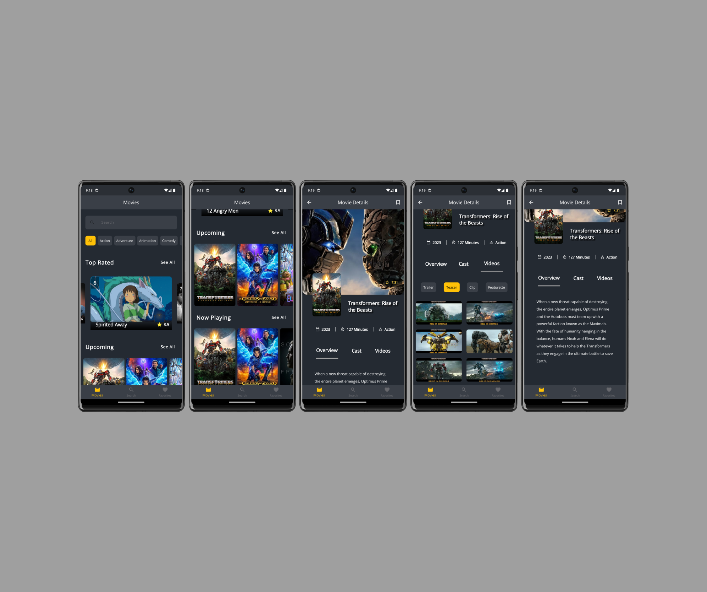
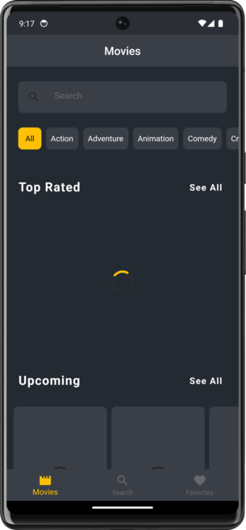
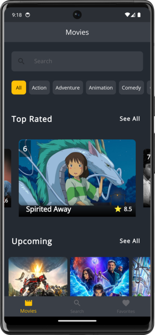
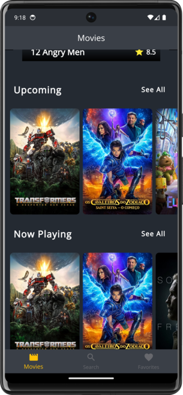
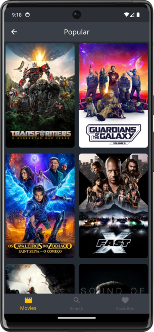
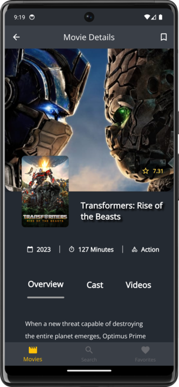
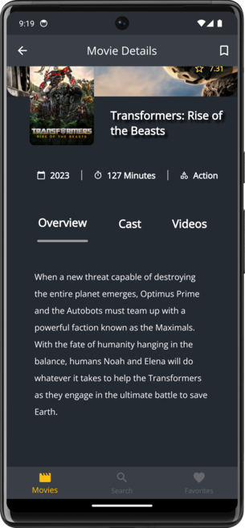
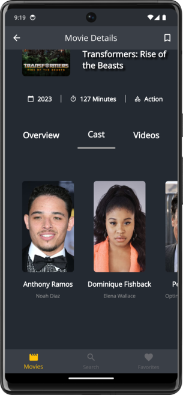
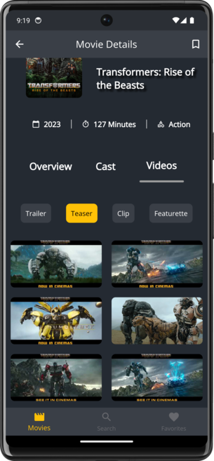

# Movies App - A simple app to search for movies (Read the README.md file for more details)

## Screenshots

## Platform Specifics

- The app is built for Android, iOS, Macos, Windows, Linux, Web.
- 1. Android
     - Make sure you add this line to the AndroidManifest.xml file
     - `<uses-permission android:name="android.permission.INTERNET" />`
     - Change minSdkVersion to 21 in the build.gradle file (in the android/app folder)
- 2. Macos
     - Make sure you add this line to the Info.plist file (in the Runner folder)
     - `<key> NSAppTransportSecurity </key> <dict> <key> NSAllowsArbitraryLoads </key> <true/> </dict>`
     - Make sure you add this line to the Release.entitlements file (in the Runner folder)
     - `<key> com.apple.security.network.client </key> <true/>`
- 3. IOS
     - Make sure internet permission is enabled in the Info.plist file (in the Runner folder)
     - `<key> NSAppTransportSecurity </key> <dict> <key> NSAllowsArbitraryLoads </key> <true/> </dict>`

## Features

- 1. Search for Movies
     - Search for movies by title
     - View movie details (overview, release date, runtime, cast, etc.)
     - View movie date, rating, and runtime, etc.
     - View movie backdrop image, poster image, and cast images
- 2. Favorite movies
     - View favorite movies
     - Add a movie to favorites
     - Remove a movie from favorites
- 3. Categorization
     - View movies by category (popular, top rated, upcoming, now playing, etc.)
     - View movies by genre (all genres, action, adventure, comedy, etc...)

## Dependencies

carousel_slider, connectivity_plus, dartz, dio, flutter, sdk, flutter_hooks, freezed_annotation, go_router, google_fonts, hooks_riverpod, json_annotation, riverpod_annotation, shared_preferences,
youtube_player_flutter

## Dev Dependencies

build_runner, flutter_lints, freezed, json_serializable, riverpod_generator
